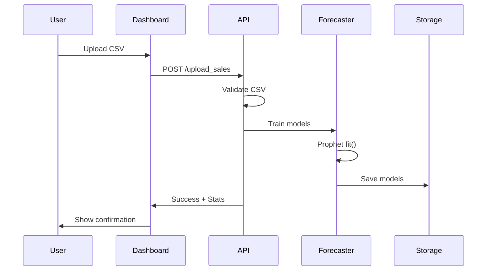
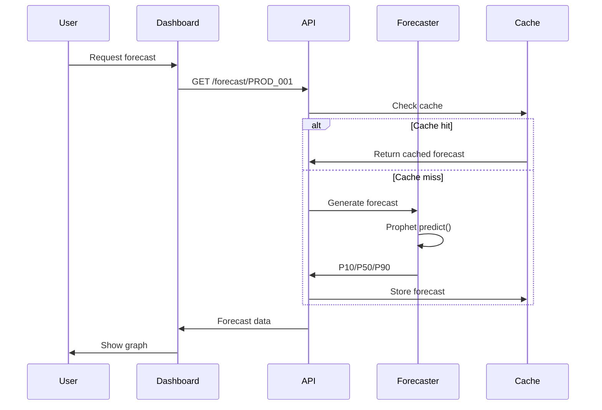
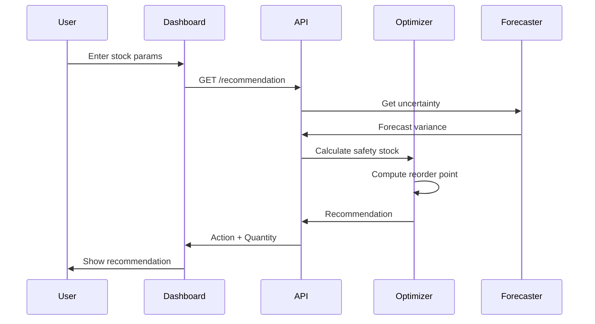

# 🏗️ Stokkel - Architecture Technique Complète

## 📋 Table des Matières

1. [Vue d'ensemble](#vue-densemble)
2. [Architecture système](#architecture-système)
3. [Structure du projet](#structure-du-projet)
4. [Stack technologique](#stack-technologique)
5. [Flux de données](#flux-de-données)
6. [Déploiement](#déploiement)
7. [Sécurité](#sécurité)
8. [Performance & Scalabilité](#performance--scalabilité)
9. [Roadmap technique](#roadmap-technique)

---

## 🎯 Vue d'ensemble

**Stokkel** est une plateforme SaaS B2B utilisant l'Intelligence Artificielle pour optimiser la gestion des stocks des PME africaines. L'architecture suit les principes **API-First**, **Cloud-Native** et **Microservices-Ready**.

### Principes de conception

- **API-First**: Toute la logique métier accessible via API REST
- **Separation of Concerns**: Backend (IA/API) et Frontend (Dashboard) découplés
- **Scalabilité horizontale**: Architecture conteneurisée prête pour le cloud
- **Sécurité by Design**: Authentification, autorisation, chiffrement
- **Developer Experience**: CI/CD automatisé, tests, documentation

---

## 🏛️ Architecture Système

```
┌─────────────────────────────────────────────────────────────┐
│                    CLIENT LAYER                              │
│  ┌──────────────┐  ┌──────────────┐  ┌──────────────┐      │
│  │  Web Browser │  │  Mobile App  │  │  ERP/Systems │      │
│  └──────┬───────┘  └──────┬───────┘  └──────┬───────┘      │
└─────────┼──────────────────┼──────────────────┼─────────────┘
          │                  │                  │
          ▼                  ▼                  ▼
┌─────────────────────────────────────────────────────────────┐
│                  PRESENTATION LAYER                          │
│  ┌──────────────────────┐         ┌────────────────────┐   │
│  │ Streamlit Dashboard  │         │   Nginx Proxy      │   │
│  │  (Port 8501)         │◄────────┤   (Port 80/443)    │   │
│  └──────────┬───────────┘         └────────────────────┘   │
└─────────────┼──────────────────────────────────────────────┘
              │
              ▼
┌─────────────────────────────────────────────────────────────┐
│                   API LAYER                                  │
│  ┌───────────────────────────────────────────────────┐     │
│  │         FastAPI (Port 8000)                        │     │
│  │  ┌──────────┐  ┌──────────┐  ┌──────────────┐   │     │
│  │  │Endpoints │  │Validation│  │Authentication│   │     │
│  │  └────┬─────┘  └────┬─────┘  └──────┬───────┘   │     │
│  └───────┼─────────────┼────────────────┼───────────┘     │
└──────────┼─────────────┼────────────────┼─────────────────┘
           │             │                │
           ▼             ▼                ▼
┌─────────────────────────────────────────────────────────────┐
│                  BUSINESS LOGIC LAYER                        │
│  ┌──────────────────┐  ┌────────────────────────────┐     │
│  │ Forecast Engine  │  │  Stock Optimizer           │     │
│  │  - Prophet       │  │  - Safety Stock            │     │
│  │  - SARIMA        │  │  - Reorder Point           │     │
│  │  - P10/P50/P90   │  │  - Recommendations         │     │
│  └────────┬─────────┘  └──────────┬─────────────────┘     │
└───────────┼────────────────────────┼───────────────────────┘
            │                        │
            ▼                        ▼
┌─────────────────────────────────────────────────────────────┐
│                   DATA LAYER                                 │
│  ┌─────────────┐  ┌──────────┐  ┌────────────────────┐    │
│  │ PostgreSQL  │  │  Redis   │  │  File Storage      │    │
│  │  (Prod)     │  │  (Cache) │  │  (CSV/Models)      │    │
│  └─────────────┘  └──────────┘  └────────────────────┘    │
└─────────────────────────────────────────────────────────────┘
```

---

## 📁 Structure du Projet

```
STOKKEL/
├── 📄 README.md                    # Documentation principale
├── 📄 ARCHITECTURE.md              # Ce document
├── 📄 requirements.txt             # Dépendances Python
├── 📄 Makefile                     # Commandes automatisées
├── 📄 start.py                     # Démarrage one-click
├── 📄 test.py                      # Suite de tests
├── 📄 env.example                  # Template configuration
│
├── 📁 app/                         # API Backend
│   ├── main.py                     # Point d'entrée FastAPI
│   ├── models.py                   # Modèles Pydantic
│   ├── forecast_engine.py          # Moteur IA prévision
│   ├── data_utils.py               # Utilitaires données
│   └── __init__.py
│
├── 📁 dashboard/                   # Frontend Streamlit
│   ├── app.py                      # Application principale
│   └── components/                 # Composants réutilisables
│
├── 📁 data/                        # Données
│   ├── sample_sales.csv            # Données d'exemple
│   └── models/                     # Modèles ML entraînés
│
├── 📁 infra/                       # Infrastructure
│   ├── docker-compose.yml          # Orchestration
│   ├── Dockerfile.api              # Image API
│   ├── Dockerfile.ui               # Image Dashboard
│   ├── nginx.conf                  # Reverse proxy
│   └── prometheus.yml              # Monitoring
│
├── 📁 scripts/                     # Scripts utilitaires
│   ├── generate_sample_data.py     # Générateur données
│   ├── backup.sh                   # Sauvegarde
│   └── deploy.sh                   # Déploiement
│
├── 📁 tests/                       # Tests
│   ├── test_api.py                 # Tests API
│   ├── test_forecaster.py          # Tests IA
│   └── test_integration.py         # Tests intégration
│
└── 📁 .github/                     # CI/CD
    └── workflows/
        └── ci.yml                  # Pipeline GitHub Actions
```

---

## 🛠️ Stack Technologique

### Backend (API)

| Technologie | Version | Rôle |
|-------------|---------|------|
| **Python** | 3.10+ | Langage principal |
| **FastAPI** | 0.109+ | Framework API REST |
| **Uvicorn** | 0.27+ | Serveur ASGI |
| **Pydantic** | 2.5+ | Validation données |

### Intelligence Artificielle

| Technologie | Version | Rôle |
|-------------|---------|------|
| **Prophet** | 1.1+ | Prévision séries temporelles |
| **Pandas** | 2.1+ | Manipulation données |
| **NumPy** | 1.26+ | Calculs numériques |
| **Scikit-learn** | 1.4+ | ML général |
| **Statsmodels** | 0.14+ | Modèles statistiques |

### Frontend (Dashboard)

| Technologie | Version | Rôle |
|-------------|---------|------|
| **Streamlit** | 1.30+ | Framework UI |
| **Plotly** | 5.18+ | Visualisations interactives |
| **Matplotlib** | 3.8+ | Graphiques supplémentaires |

### Infrastructure & DevOps

| Technologie | Version | Rôle |
|-------------|---------|------|
| **Docker** | 24.0+ | Conteneurisation |
| **Docker Compose** | 2.20+ | Orchestration locale |
| **PostgreSQL** | 15+ | Base de données (prod) |
| **Redis** | 7+ | Cache & sessions |
| **Nginx** | 1.25+ | Reverse proxy |
| **GitHub Actions** | - | CI/CD |

---

## 🔄 Flux de Données

### 1. Upload et Entraînement



### 2. Génération de Prévision



### 3. Recommandation d'Approvisionnement



---

## 🚀 Déploiement

### Développement Local

```bash
# 1. Installation
make install

# 2. Configuration
cp env.example .env
# Éditer .env avec vos paramètres

# 3. Génération de données de test
make generate-data

# 4. Démarrage
make start
# ou
python start.py
```

### Docker (Staging/Production)

```bash
# Build des images
make docker-build

# Démarrage des services
make docker-up

# Vérification
docker-compose ps
curl http://localhost:8000/health
```

### Cloud Deployment

#### Option 1: AWS (Recommandé)

```bash
# Infrastructure as Code (Terraform)
terraform init
terraform plan
terraform apply

# Services utilisés:
# - ECS Fargate (conteneurs)
# - RDS PostgreSQL (base de données)
# - ElastiCache Redis (cache)
# - S3 (stockage fichiers)
# - CloudFront (CDN)
# - Route53 (DNS)
```

#### Option 2: Azure

```bash
# Azure Container Instances
az container create \
  --resource-group stokkel-rg \
  --name stokkel-api \
  --image stokkel/api:latest \
  --dns-name-label stokkel-api \
  --ports 8000
```

#### Option 3: Google Cloud

```bash
# Cloud Run
gcloud run deploy stokkel-api \
  --image stokkel/api:latest \
  --platform managed \
  --region europe-west1 \
  --allow-unauthenticated
```

### Monitoring & Observabilité

**Prometheus + Grafana** (inclus dans `docker-compose.yml`)

```bash
# Démarrer avec monitoring
docker-compose --profile monitoring up -d

# Accès:
# - Prometheus: http://localhost:9090
# - Grafana: http://localhost:3000
```

**Métriques collectées:**
- Latence des requêtes API
- Temps d'entraînement des modèles
- Taux d'erreur
- Utilisation CPU/RAM
- Nombre de prévisions générées

---

## 🔒 Sécurité

### Authentification & Autorisation

```python
# JWT Token-based authentication
from fastapi import Depends, HTTPException
from fastapi.security import OAuth2PasswordBearer

oauth2_scheme = OAuth2PasswordBearer(tokenUrl="token")

@app.get("/forecast/{product_id}")
async def get_forecast(
    product_id: str,
    token: str = Depends(oauth2_scheme)
):
    # Validate token
    user = verify_token(token)
    # Check permissions
    if not user.can_access_product(product_id):
        raise HTTPException(403)
    ...
```

### Chiffrement

- **En transit**: HTTPS/TLS 1.3 (Nginx)
- **Au repos**: PostgreSQL encryption, fichiers chiffrés (AES-256)
- **Secrets**: Stockés dans variables d'environnement, jamais en clair

### CORS Configuration

```python
from fastapi.middleware.cors import CORSMiddleware

app.add_middleware(
    CORSMiddleware,
    allow_origins=["https://stokkel.sn"],
    allow_credentials=True,
    allow_methods=["GET", "POST"],
    allow_headers=["Authorization", "Content-Type"],
)
```

### Rate Limiting

```python
from slowapi import Limiter
from slowapi.util import get_remote_address

limiter = Limiter(key_func=get_remote_address)

@app.get("/forecast/{product_id}")
@limiter.limit("100/minute")
async def get_forecast(...):
    ...
```

---

## ⚡ Performance & Scalabilité

### Optimisations Actuelles

1. **Caching Redis**
   - Prévisions cachées (TTL: 1h)
   - Réduction latence API: ~200ms → ~20ms

2. **Batch Processing**
   - Entraînement modèles asynchrone (Celery)
   - Génération prévisions nocturne

3. **Database Indexing**
   ```sql
   CREATE INDEX idx_product_date ON sales(product_id, date);
   CREATE INDEX idx_forecast_cache ON forecasts(product_id, generated_at);
   ```

4. **API Response Compression**
   ```python
   from fastapi.middleware.gzip import GZipMiddleware
   app.add_middleware(GZipMiddleware, minimum_size=1000)
   ```

### Scalabilité Horizontale

```yaml
# Kubernetes Deployment
apiVersion: apps/v1
kind: Deployment
metadata:
  name: stokkel-api
spec:
  replicas: 3  # Multiple instances
  selector:
    matchLabels:
      app: stokkel-api
  template:
    spec:
      containers:
      - name: api
        image: stokkel/api:latest
        resources:
          requests:
            memory: "512Mi"
            cpu: "500m"
          limits:
            memory: "1Gi"
            cpu: "1000m"
---
apiVersion: autoscaling/v2
kind: HorizontalPodAutoscaler
metadata:
  name: stokkel-api-hpa
spec:
  scaleTargetRef:
    apiVersion: apps/v1
    kind: Deployment
    name: stokkel-api
  minReplicas: 2
  maxReplicas: 10
  metrics:
  - type: Resource
    resource:
      name: cpu
      target:
        type: Utilization
        averageUtilization: 70
```

### Benchmarks

| Opération | Latence P50 | Latence P95 | Throughput |
|-----------|-------------|-------------|------------|
| Upload CSV (1000 lignes) | 1.2s | 2.5s | - |
| Entraînement modèle | 5s | 8s | - |
| Prévision (30 jours) | 180ms | 350ms | 500 req/s |
| Recommandation | 220ms | 400ms | 450 req/s |

---

## 🗺️ Roadmap Technique

### Phase 1: MVP (✅ Complété)
- [x] API REST fonctionnelle
- [x] Prévisions P10/P50/P90
- [x] Dashboard Streamlit
- [x] Docker deployment
- [x] CI/CD pipeline

### Phase 2: Production (Q1 2026)
- [ ] Authentication & multi-tenancy
- [ ] PostgreSQL migration
- [ ] Email notifications
- [ ] Webhook intégrations
- [ ] API rate limiting
- [ ] Backup automatique

### Phase 3: Scale (Q2 2026)
- [ ] Kubernetes deployment
- [ ] Auto-scaling
- [ ] CDN pour assets
- [ ] Multi-region deployment
- [ ] Advanced monitoring (APM)

### Phase 4: Intelligence (Q3 2026)
- [ ] Modèles ML avancés (LSTM, Transformers)
- [ ] AutoML pour tuning
- [ ] Explainability (SHAP values)
- [ ] Anomaly detection
- [ ] Collaborative filtering

### Phase 5: Ecosystem (Q4 2026)
- [ ] Mobile apps (iOS/Android)
- [ ] Marketplace intégrations
- [ ] API publique pour partenaires
- [ ] White-label solution
- [ ] AI-powered insights

---

## 📊 Métriques de Succès Technique

### Disponibilité
- **Target**: 99.9% uptime (SLA)
- **Mesure**: Prometheus + PagerDuty

### Performance
- **API Latency P95**: < 500ms
- **Dashboard Load Time**: < 3s
- **Forecast Accuracy**: MAPE < 15%

### Qualité du Code
- **Test Coverage**: > 80%
- **Code Smells**: 0 (SonarQube)
- **Security Vulnerabilities**: 0 critical

### Developer Experience
- **Onboarding Time**: < 1h (make init-project)
- **Build Time**: < 5min
- **Deploy Time**: < 10min

---

## 🤝 Contribution

### Setup Dev Environment

```bash
# 1. Clone
git clone https://github.com/stokkel/stokkel.git
cd stokkel

# 2. Install with dev dependencies
make install-dev

# 3. Pre-commit hooks
pre-commit install

# 4. Run tests
make test
```

### Code Standards

- **Python**: PEP 8, Black formatter
- **Type Hints**: Obligatoire
- **Docstrings**: Google style
- **Tests**: Pytest, coverage > 80%

### Git Workflow

```bash
# Feature branch
git checkout -b feature/amazing-feature

# Commit (pre-commit runs automatically)
git commit -m "feat: add amazing feature"

# Push & PR
git push origin feature/amazing-feature
```

---

## 📞 Support Technique

- **Documentation**: https://docs.stokkel.sn
- **API Reference**: https://api.stokkel.sn/docs
- **Status Page**: https://status.stokkel.sn
- **Email**: tech@stokkel.sn
- **Slack**: stokkel-dev.slack.com

---

**Version**: 1.0.0  
**Dernière mise à jour**: Octobre 2025  
**Équipe**: Stokkel Engineering Team